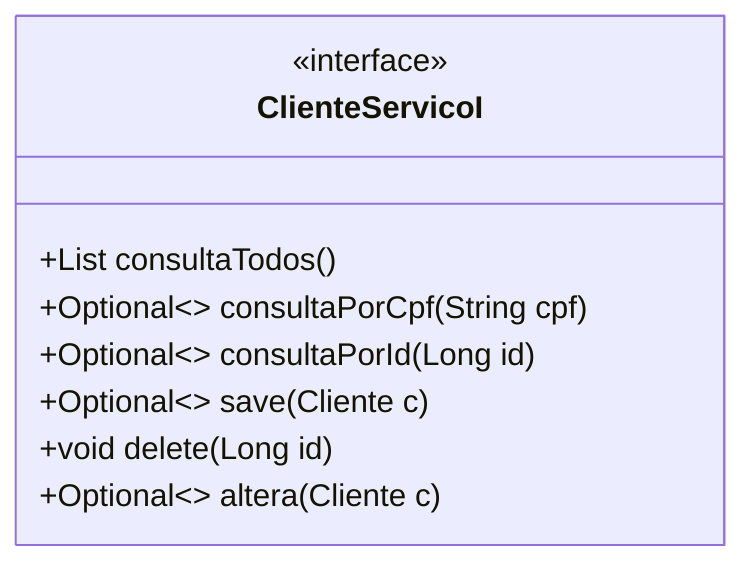
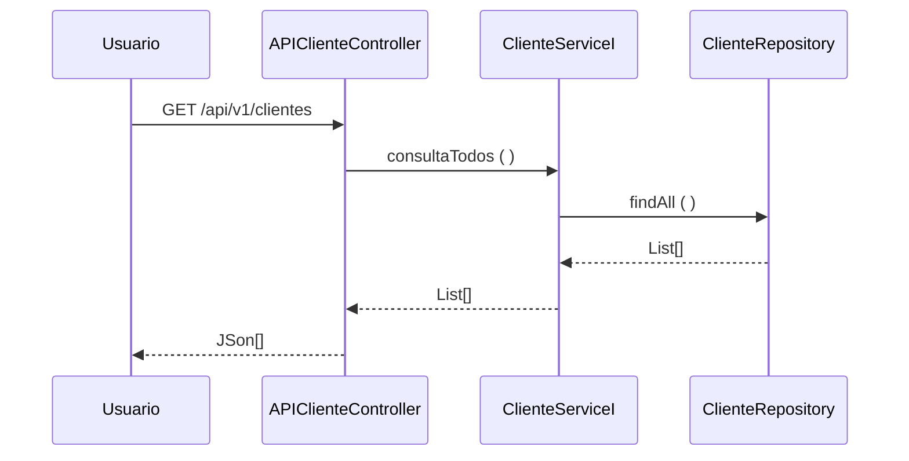

## Fatec ZL - Centro Paula Souza

##### Disciplina - Programação Web III 
Grupo CPDev
- <a href = "https://github.com/ademiralves"> Ademir Alves </a>
- <a href = "https://github.com/Aryel15"> Aryel Anne </a>
- <a href = "https://github.com/BiaJL"> Bianca Jesus </a>
- <a href = "https://github.com/DiogoLCarvalho"> Diogo Carvalho </a>
- <a href = "https://github.com/FernandaSena07"> Fernanda Sena </a>
- <a href = "https://github.com/leocaje"> Leonardo Cajé</a>

##### Processo de Desenvolvimento de Software - PDS
> O PDS segue uma abordagem interativa incremental adaptada do Scrum. Cada interação tem uma definição de pronto estabelecida com objetivo de controlar a qualidade. 

##### Estudo de Caso – SOCIELOO
> No contexto do projeto interdisciplinar o estudo de caso tem como objetivo desenvolver e implantar um site centralizador de ONGs, instituições e projetos sociais da cidade de São Paulo, com o propósito de divulgá-las a possíveis doadores e voluntários e criar, assim, um ELO entre ONGs e a sociedade. O diferencial do site é a maior flexibilidade do usuário para a escolha de Projetos sociais com a localização e segmento de sua preferência, podendo favoritar, analisar e avaliar cada projeto.

##### Levantamento de Requisitos
| Identificador | Descrição | Prioridade | 
| ------------ | ------------------------------------------------------------------------ | ------| 
| REQ01 – Cadastrar ONGs/Instituições/Projetos Sociais | **Como** – ONG/Instituição/Projeto Social;  **Eu quero** – Cadastrar no site a ação social no site;  **De maneira que** – Seja possível criar um perfil próprio para o projeto (Página de ONG). | Alta |
| REQ02 – Consultar ONGs/Instituições/Projetos Sociais | **Como** – Usuário;  **Eu quero** – Consultar uma ONG´s/Instituições/Projetos Sociais;  **De maneira que** – Seja possível obter informações sobre a ONG´s/Instituições/Projetos Sociais como descrição textual, sua história, imagens, informações de contato e de doação e mapa de localização. | Alta |
| REQ03 – Atualizar ONGs/Instituições/Projetos Sociais | **Como** – ONG´s/Instituições/Projetos Sociais;  **Eu quero** – Alterar os dados da ONG/Instituição/Projeto Social;  **De maneira que** – Seja possível atualizar informações de ONG/Instituição/Projeto Social, nos casos de mudanças de endereço, informações de contato, imagens e localização. | Média |
| REQ04 – Excluir ONGs/Instituições/Projetos Sociais | **Como** – ONG/Instituição/Projeto Social OU Moderador/Administrador;  **Eu quero** (se ONG/Instituição/Projeto Social) – Excluir meu cadastro e minha Página de ONG do site;  **De maneira que** – Meus dados não sejam mais divulgados pelo site.  **Eu quero** (se Moderador/Administrador) – Excluir o cadastro de uma ONG e sua Página de ONG do site;  **De maneira que** – As informações publicadas por aquele projeto não estivessem mais disponíveis no site. | Média |
| REQ05 – Cadastrar Usuário | **Como** – Usuário;  **Eu quero** – Fazer um cadastro de usuário no site;  **De maneira que** – Seja possível criar um perfil próprio para favoritar ONG’s por segmento e região, avaliar ONG’s e preencher formulários de ONG’s. | Alta |
| REQ06 – Consultar Usuário | **Como** – ONG/Instituição/Projeto Social OU Moderador/Administrador;  **Eu quero** – Consultar o perfil de um usuário;  **De maneira que** – Seja possível obter informações sobre o usuário e bloquear ou excluir o seu perfil, se necessário. | Baixa |
| REQ07 – Atualizar Usuário | **Como** – Usuário;  **Eu quero** – Alterar seus dados de Usuário;  **De maneira que** – Seja possível atualizar informações de usuário. | Média |
| REQ08 – Excluir Usuário | **Como** – Usuário OU Moderador/Administrador;  **Eu quero** (se Usuário) – Excluir meu cadastro e meu perfil de usuário;  **De maneira que** – Meus dados não sejam mais divulgados pelo site.  **Eu quero** (se Moderador/Administrador) – Excluir o cadastro de um usuário do site;  **De maneira que** – As informações daquele usuário não estiverem mais disponíveis no site. | Média |
| REQ09 – Login de ONGs e usuários | **Como** – Usuário;  **Eu quero** – Fazer doações, pesquisar ações sociais, avaliar e comentar;  **De maneira que** – Possa consultar e atualizar o perfil de usuário. | Alta |
| REQ10 – Fazer Avalições | **Como** – Usuário;  **Eu quero** – Escrever comentários;  **De maneira que** – Seja possível criar comentários em perfis de ONGs. | Média |
| REQ11 – Excluir Avaliações | **Como** – Moderador;  **Eu quero** – Excluir comentários;  **De maneira que** – Possa retirar comentários ofensivos e ou de conteúdo impróprio. | Média |

##### Casos de teste 
| Identificador | Cenário de uso |
| ------------ | ------------------------------------------------------------------------ |
| REQ01CT01 | **Dado que** – A ONG/Instituição/Projeto social não está cadastrada;  **Quando**   – O usuário solicitar cadastro de ação social;  **Então** – O sistema envia os dados cadastrais para a aprovação do moderador. Se as informações estiverem completas e os dados checarem, é enviada uma mensagem para a ONG indicando que o cadastro foi concluído com sucesso e a ONG recebe uma Página de ONG publicada no site.  |
| REQ01CT02 | **Dado que** – A ONG/Instituição/Projeto social não está cadastrada;  **Quando**   – O usuário solicitar cadastro de ação social;   **Então** – O sistema envia os dados de cadastro para a aprovação do moderador. Se houver informações faltando e/ou incongruentes, o moderador veta o cadastro e a publicação da Página de ONG. É enviada uma mensagem, para a ONG, informando quais dados faltam e/ou apresentam incongruências e solicitando sua correção, para posterior avaliação. |
| REQ02CT01 | **Dado que** – A ONG/Instituição/Projeto Social CNPJ 62.823.257/0001-09 está cadastrado; **Quando**   - o usuário solicitar uma consulta pelo CNPJ; **Então** – o sistema apresenta os detalhes da ONG´s/Instituições/Projetos Sociais cadastrado|
| REQ03CT01 | **Dado que** – A ONG/Instituição/Projeto Social;  **Quando**   – Quer alterar seus dados de ONG/Instituição/Projeto Social;  **Então** – O sistema envia uma mensagem para a ONG/Instituição/Projeto Social comunicando que os dados foram atualizados|
| REQ03CT02  | **Dado que** – A ONG/Instituição/Projeto Social; **Quando**   – Quer alterar seus dados de ONG/Instituição/Projeto Social; **Então** – O sistema envia uma mensagem para a ONG/Instituição/Projeto Social comunicando que houve uma falha na tentativa de atualizar os dados cadastrais |
| REQ04CT01  | **Dado que** – A ONG foi excluída do site; **Quando**   (ONG/Instituição/Projeto Social) – tiver solicitado a remoção de cadastro; **Então** – A ONG é informada, via mensagem pop-up, de que seu cadastro foi excluído com sucesso; **Quando**   (Moderador/Administrador) – tiver optado por remover o cadastro de uma ONG; **Então** – A ONG recebe uma notificação, via e-mail, de que seu cadastro foi removido do site, informando o devido motivo da exclusão  |
| REQ05CT01 | **Dado que** – O usuário não está cadastrado; **Quando**   – O usuário solicitar o cadastro de doador;  **Então** – O sistema envia uma mensagem de cadastro concluído com sucesso |
| REQ05CT02 | **Dado que** – O usuário não está cadastrado; **Quando**   – O usuário cadastrar o e-mail com o código de validação errado;  **Então** - O sistema não validará o cadastro e mostrará uma mensagem de erro |
| REQ06CT01 | **Dado que** – O usuário de nome João Pedro de Souza está cadastrado; **Quando**   - o usuário solicitar uma consulta pelo NOME;  **Então** – o sistema apresenta os detalhes do usuário cadastrado  |
| REQ07CT01 | **Dado que** – O usuário;  **Quando**   – Quer alterar seus dados de Usuário;  **Então** – O sistema envia uma mensagem para o usuário comunicando que os dados foram atualizados.|
| REQ07CT02 | **Dado que** – O usuário;   **Quando**   – Quer alterar seus dados de Usuario;  **Então** – O sistema envia uma mensagem para o usuário comunicando que houve uma falha na tentativa de atualizar os dados cadastrais|
| REQ08CT01 | **Dado que** – O usuário foi excluído do site;  **Quando**   (ONG/Instituição/Projeto Social) – tiver solicitado a remoção de cadastro; **Então** – O usuário recebe uma notificação, via e-mail, de que seu cadastro foi removido do site. |
| REQ13CT01| **Dado que** – o usuário está cadastrado;  **Quando**  - Inserir a opção de “Esqueci a senha”;  **Então**- Sistema envia um link para redefinição de senha no e-mail cadastrado|
| REQ14CT01 | **Dado que** – o usuário não esteja logado;  **Quando**   – For escrever um comentário;  **Então** - O sistema irá pedir para que faça o login ou cadastre uma conta para comentar. |

##### Product Backlog 
| ID | Módulo | Como... | Eu quero... | Para que... | Prioridade | Sprint | Status | 
| -- | ------ | ----- | ------------------------ |---------------------------------------------------------- | ------ | --- | ------ | 
| 1 | Cadastro | ONG | Poder cadastrar minha ONG no site, através de informações como: CNAE, nome, e-mail e senha | Eu possa ter minha Página de ONG no site, descrever minha ONG e mostrar para as pessoas como ajudar minha causa. | Alta | 1 | Concluído |
| 2 | Cadastro | Uuário | Fazer um cadastro com meu nome, e-mail e senha | Eu possa acessar as páginas de Ongs para saber mais sobre suas causas, escolher as que mais me interessam e ver como posso ajudar. | Alta | 4 | Concluído |
| 3 | Cadastro | Administrador | Fazer meu cadastro em uma página a parte do site, específica para funcionário, com o meu número de registro, nome, e-mail e senha | Eu possa ter acesso aos dados e código do site, para que possa verificar informações e excluir contas e comentários. | Alta | 4 | Em andamento |
| 4 | Validação | Sistema | Validar ONG na base de dados do site | As informações das ONGs sejam conferidas como autênticas e a instituição seja liberada para criar uma Página de ONG e compartilhar informações de seus trabalhos. | Alta | 1 | Concluído |
| 5 | Login | ONG/Usuário | Fazer Login através do e-mail e senha | Eu tenha acesso a minha conta cadastrada. | Alta | 2 | Concluído |
| 6 | Login | Administrador | Fazer Login em uma página a parte do site através do meu número de registro e senha. | Eu tenha acesso a minha conta cadastrada de funcionário | Alta | 4 | Em andamento |
| 7 | Login | ONG/Usuário/ Administrador | Recuperação de senha | Caso tenha esquecido minha senha, eu possa ter acesso ao link de redefinição de senha enviado para meu e-mail cadastrado e assim conseguir fazer o login. | Alta | 5 | A fazer |
| 8 | Criação | ONG | Criar uma Página de ONG personalizada apenas para minha ONG | Se disponibilizar informações da minha instituição aos usuários (descrição, endereço, contato, ícone, avaliações de usuários conta corrente, agência, pix) e permitir que se promovam as atividades relevantes ao meu público. | Alta | 2 | Concluído |
| 9 | Criação | Usuário | Fazer comentários nas Páginas de ONG | Possa falar sobre os projetos sociais e minha experiência com aquelas instituições. | Média | 5 | A fazer |
| 10 | Alteração | ONG | Alterar dados de cadastro, como o e-mail e senha | Se necessário, minha instituição possa atualizar seus dados, como forma de segurança. | Alta | 1 | Concluído |
| 11 | Alteração | ONG | Alterar as informações (descrição, endereço, contato, ícone) da minha Página de ONG | A Página de ONG permaneça sempre com informações atualizadas para poder receber doações. | Alta | 2 | Concluído |
| 12 | Alteração | Usuário | Alterar dados cadastrais como e-mail e senha | Se necessário, eu possa atualizar meus dados, como forma de segurança. | Alta | 4 | Concluído |
| 13 | Alteração | Usuário | Alterar comentários, onde poderei alterá-lo em até 24hr depois que o fiz | Possa corrigir erros ortográficos, de informação ou digitação acidental. | Baixa | 5 | A fazer |
| 14 | Exclusão | ONG | Deletar o cadastro e as informações da minha ONG do site | Não se divulgue mais informações da ONG por falta de interesse, insatisfação com o serviço ou porque ela não existe mais. | Alta | 1 | Concluído |
| 15 | Exclusão | Usuário | Deletar meu cadastro através da minha página de configurações no site | Por motivos pessoais não quero mais manter o meu cadastro e receber informações das Ongs do site. | Alta | 4 | Concluído |
| 16 | Exclusão | Administrador | Excluir ONG através de minhas permissões como funcionário e acesso às informações de ONGs cadastradas | As instituições que estão prestando informações falsas, descobertas por denúncias ou supervisão dos funcionários, não sejam mais divulgadas no ambiente do site e comprometam a opinião pública sobre demais ONGs ou o próprio site. | Alta | 4 | Em andamento |
| 17 | Exclusão | Administrador | Excluir usuário através de minhas permissões como funcionário e acesso às informações de usuários cadastrados | Os usuários mal-intencionados não possam afetar a imagem de trabalhos divulgados ou do próprio site. | Alta | 4 | A fazer |
| 18 | Exclusão | Administrador | Excluir comentários de usuários nas Páginas de ONG | Se evite ofensas e comentários mal-intencionados que afetem a honra de terceiros (ONGs ou outros usuários). | Média | 5 | A fazer |
| 19 | ONG | ONG | Denunciar usuários que fazem comentários difamando ou insultando a ONG e/ou funcionários | As instituições não tenham suas reputações indevidamente manchadas por usuários mal-intencionados. | Baixa | 5 | A fazer |
| 20 | Usuário | Usuário | Filtrar buscas de acordo com meus interesses (por nome, região, segmento ou localização atual) | Encontre ONGs que se adequem ao perfil de instituição eu quero ajudar. | Alta | 4 | Concluído |
| 21 | Usuário | Usuário | Denunciar ONG através da opção de denúncias, em que coloco os motivos por fazê-lo | O administrador verifique aquela página denunciada e exclua as instituições fraudulentas. | Alta | 5 | Em andamento |
| 22 | Usuário | Usuário | Avaliar ONGs em suas respectivas Páginas de ONG | Fazer avaliações com base em minhas experiencias e minha satisfação com aquela causa e instituição. | Média | 5 | Em andamento |
| 23 | Usuário | Usuário | Compartilhar ONG através de um botão em que envio o link daquela Página de ONG do site para quem eu desejar | Consiga compartilhar as Páginas de ONG e divulgar as instituições e seus trabalhos para as pessoas. | Baixa | 4 | Concluído |
| 24 | Usuário | Usuário | Ter acesso ao FAQ, onde terei respostas de perguntas frequentes sobre o site | Tenha informações sobre o site e consiga mexer nele com maior facilidade. | Baixa | 4 | Concluído |
| 25 | Administrador | Administrador | Gerenciar banco de dados | Otimize a acessibilidade dos dados relevantes do sistema, a manutenção de dados ou alterações no banco. | Alta | 5 | Em andamento |
| 26 | Acessibilidade | ONG/Usuário/ Administrador | Ter acesso ao menu de acessibilidade do site | Possa mudar o tamanho das letras e o contraste das cores conforme a minha necessidade. | Média | 2 | Concluído |
| 27 | Acessibilidade | ONG/Usuário/ Administrador | Atalhos do teclado | Possa ter acesso mais rápido e prático as funções do menu de acessibilidade e ir para a home e rodapé do site. | Média | 2 | Concluído |
| 28 | Acessibilidade | ONG/Usuário/ Administrador | VLibras | Em caso de ser deficiente auditivo, eu também possa acessar e entender os recursos do site, através do intérprete de libras. | Média | 2 | Concluído |
| 29 | Responsividade | ONG/Usuário/ Administrador | Um site responsivo | Minha navegação seja fluída e o site funcione adequadamente em qualquer dispositivo que eu esteja utilizando para acessá-lo. | Média | 5 | A fazer |
| 30 | Perfil | ONG | Desejo ter um perfil | Possa ter acesso as opções funcionalidades disponíveis como: configurações de perfil (alterar dados do perfil, ícone de perfil), analisar as atividades relacionado aos comentários, avaliações. | Média | 3 | Concluído |
| 31 | Perfil | Usuário | Desejo ter um perfil | Nossa ter acesso as opções funcionalidades disponíveis como: configurações de perfil (alterar dados do perfil, ícone de perfil), histórico de atividades (comentários, avaliações e denúncias), alterar informações de ONG’s favoritadas e ter autonomia na permissão da minha localização atual. | Média | 4 | Concluído |
| 32 | Perfil | Administrador | Desejo ter um perfil | Possa ter acesso as opções funcionalidades disponíveis como: gerenciar perfil (alterar, deletar), gerenciar administradores (cadastrar, alterar e deletar), relatório de comentários e ONG’s denunciadas, relatório de ONG’s cadastradas e deletadas (com descrição do motivo). | Média | 5 | Em andamento | 
| 33 | Relatório | Sistema | Gerar relatórios | Exiba resultados do site para os administradores acompanharem as métricas de total de ONGs cadastradas, a quantidade de ONGs cadastradas por mês, segmento e região, o total de usuários cadastrados e a quantidade de usuários cadastrados por mês. | Média | 5 | Em andamento | 
| 34 | Readme | Administrador | Atualização de readme do GitHub | Atualizar informações do README no GitHub, para que as pessoas tenham acesso atualizadas do projeto Socieloo. | Média | 5 | Concluído |
| 35 | Testes | Desenvolvedor | Efetuar testes de códigos e aplicação | Para verificar se há alguma deformidade e necessidade de alteração. | Alta | 5 | Em andamento |
| 36 | Termos de uso | Usuário/ONG | Termo de utilização do site | Para que eu tenha informações sobre os termos de uso de acesso. | Média | 5 | Em andamento |

##### Sprint Backlog 
> Cada requisito tem um identificador único de maneira que seja possível rastrear a necessidade do cliente com a implementação do software. 

##### Definição de pronto 
> O sprint será considerado concluido quando: 
> 1) Os casos de teste de aceitação forem executados e obtiverem 100% de satisfatorios. Os casos de teste (CT) são rastreáveis para os requisiitos (REQ). O elo de rastreabilidade 
é estabelecido pelo identificador do caso de teste.
> 2) Depois de executado os casos de teste com 100% de satisfatorios o código deve ser armazenado no github (commit). 

O modelo de dominio (Larman, 2006 - classes conceituais ou classes de negócio) foi definido considerando as seguintes classes: 

>
A visão lógica da arquitetura para API de Cliente é apresentada na figura abaixo. A visã lógica descreve como o código está organizado, as classes os pacotes e os relacionamentos entre eles. 
 
>A entidade Cliente foi identificada como um serviço (ERL, 2007 - serviço do tipo entidade) o contrado das operações de sistema (LARMAN, 2006, pag.140) foram definidas no diagrama abaixo. 

>O diagrama de sequência descreve como os varios componentes arquiteturais colaboram para manipular uma operação de sistema (exemplo para operação consultaTodos()) 

>Referencias 
- [1] KRUCHTEN, Philippe. Reference: Title: Architectural blueprints—the “4+ 1” view model of software architecture. IEEE software, v. 12, n. 6, 1995. 
- [2] RICHARDSON, Chris. Microservices patterns: with examples in Java. Simon and Schuster, 2018. 
- [3] ERL, Thomas. SOA principles of service design (the Prentice Hall service-oriented computing series from Thomas Erl). Prentice Hall PTR, 2007. 
- [4] LARMAN, Craig. Utilizando UML e padrões. 2aed., Porto Alegre: Bookman Editora, 2006 (pag. 147)

